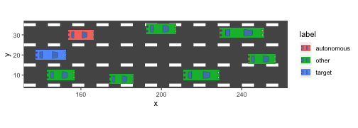

<!-- README.md is generated from README.Rmd. Please edit that file -->


[](https://travis-ci.org/brodieG/ggbg)
[](https://codecov.io/github/brodieG/ggbg?branch=master)
[](https://cran.r-project.org/package=ggbg)

Assorted experimental `ggplot2` extensions.  This package is partly a learning
exercise for myself, so not all contents will be useful to others.

## position_waterfall

A position adjustment that both stacks and dodges bars to create waterfall
charts:


```r
set.seed(1)
p <- ggplot(data.frame(x=1:20, y=rnorm(20)), aes(x=x, y=y, fill=y > 0))
p + geom_col()
p + geom_col(position='waterfall')
```
<div style='max-width: 49%; text-align: center; white-space: nowrap;'>

</div>

It is primarily intended for `geom_col`, but can be used with arbitrary geoms:


```r
p2 <- p + geom_col(position='waterfall')
p2 + geom_point(position='waterfall')
p2 + geom_point(position='waterfall') +
  geom_point(position=position_waterfall(vjust=1), color='red', size=4)
```
<div style='max-width: 49%; text-align: center; white-space: nowrap;'>

</div>

If you use arbitrary geoms you may need to adjust position with `vjust`.

It is can also be used with stats:


```r
dat.norm <- data.frame(x=rnorm(1000))
ggplot(dat.norm, aes(x=x)) + stat_bin()
ggplot(dat.norm, aes(x=x)) + stat_bin(position='waterfall')
```
<div style='max-width: 49%; text-align: center; white-space: nowrap;'>

</div>

## geom_car

Plot cars!  This geom was implemented on a lark as an answer to an [SO
Question](https://stackoverflow.com/questions/22159087/is-it-possible-to-draw-diagrams-in-r/22207979#22207979).


```r
ggplot(
  geom.car.data,  # ggbg data set
  aes(x=x, y=y, length=length, width=width, fill=label)
) +
geom_hline(yintercept=seq(5, 35, by=10), color="white", size=2, linetype=2) +
geom_car() +
coord_equal() +
theme(panel.background = element_rect(fill="#555555"),
  panel.grid.major = element_blank(),
  panel.grid.minor = element_blank())
```



## Installation

This package is currently github-only.  You can get it with
`devtools::install_github('brodieg/ggbg')` or:


```r
f.dl <- tempfile()
f.uz <- tempfile()
github.url <- 'https://github.com/brodieG/ggbg/archive/master.zip'
download.file(github.url, f.dl)
unzip(f.dl, exdir=f.uz)
install.packages(file.path(f.uz, 'ggbg-master'), repos=NULL, type='source')
unlink(c(f.dl, f.uz))
```

## Related Packages

* [ggplot2](https://github.com/tidyverse/ggplot2)

## Acknowledgments

* R Core for developing and maintaining such a wonderful language.
* CRAN maintainers, for patiently shepherding packages onto CRAN and maintaining
  the repository, and Uwe Ligges in particular for maintaining
  [Winbuilder](http://win-builder.r-project.org/).
* [Hadley Wickham](https://github.com/hadley/) for `ggplot2`, and in particular
  for making it so easily extensible.
* [Jim Hester](https://github.com/jimhester) because
  [covr](https://cran.r-project.org/package=covr) rocks.
* [Dirk Eddelbuettel](https://github.com/eddelbuettel) and [Carl
  Boettiger](https://github.com/cboettig) for the
  [rocker](https://github.com/rocker-org/rocker) project, and [Gábor
  Csárdi](https://github.com/gaborcsardi) and the
  [R-consortium](https://www.r-consortium.org/) for
  [Rhub](https://github.com/r-hub), without which testing bugs on R-devel and
  other platforms would be a nightmare.
* [Hadley Wickham](https://github.com/hadley/) for
  [devtools](https://cran.r-project.org/package=devtools) and with [Peter
  Danenberg](https://github.com/klutometis) for
* [Yihui Xie](https://github.com/yihui) for
  [knitr](https://cran.r-project.org/package=knitr) and  [J.J.
  Allaire](https://github.com/jjallaire) etal for
  [rmarkdown](https://cran.r-project.org/package=rmarkdown), and by extension
  John MacFarlane for [pandoc](http://pandoc.org/).
* All open source developers out there that make their work freely available
  for others to use.
* [Github](https://github.com/), [Travis-CI](https://travis-ci.org/),
  [Codecov](https://codecov.io/), [Vagrant](https://www.vagrantup.com/),
  [Docker](https://www.docker.com/), [Ubuntu](https://www.ubuntu.com/),
  [Brew](https://brew.sh/) for providing infrastructure that greatly simplifies
  open source development.
* [Free Software Foundation](http://fsf.org/) for developing the GPL license and
  promotion of the free software movement.
